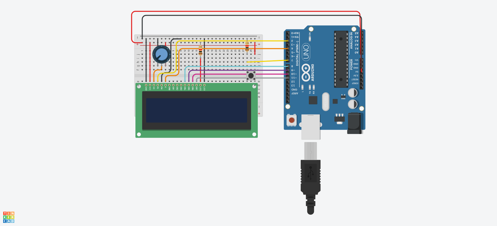

# EndellesRunnerArduGame
[JOGO] desenvolvido para arduino
### Endeless Runner

Jogo desenvolvido para plataforma arduino.</br>
Componentes:
* Display 16x2.
* Push button.

### Regras do jogo
Ao apertar o botão o personagem ira "pular" para a linha de cima.
a cada traço que você desviar sera um ponto contabilizado.

Altere as variaveis ```velocidade``` e ```velocidadeFinal``` para controlar a dificuldade do jogo.

**Instale no seu arduino e divirta-se**


[Link para teste no Tinkercad](https://www.tinkercad.com/things/2p7MHLkXCEb)

